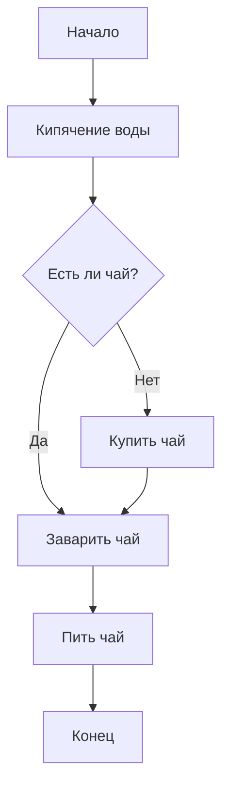
```mermaid
graph TD
    A[Начало] --> B[Кипячение воды]
    B --> C{Есть ли чай?}
    C -->|Да| D[Заварить чай]
    C -->|Нет| E[Купить чай]
    E --> D
    D --> F[Пить чай]
    F --> G[Конец]
```
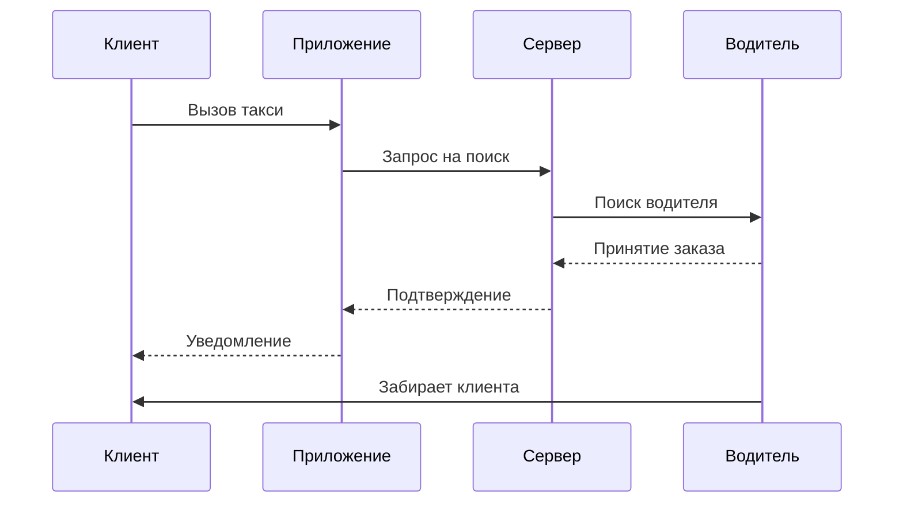
```mermaid
sequenceDiagram
    participant Клиент
    participant Приложение
    participant Сервер
    participant Водитель

    Клиент->>Приложение: Вызов такси
    Приложение->>Сервер: Запрос на поиск
    Сервер->>Водитель: Поиск водителя
    Водитель-->>Сервер: Принятие заказа
    Сервер-->>Приложение: Подтверждение
    Приложение-->>Клиент: Уведомление
    Водитель->>Клиент: Забирает клиента
```
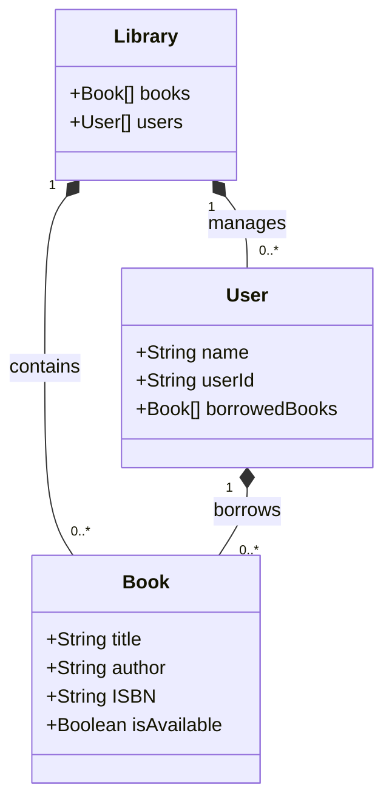
```mermaid
classDiagram
    class Library {
        +Book[] books
        +User[] users
    }

    class User {
        +String name
        +String userId
        +Book[] borrowedBooks
    }

    class Book {
        +String title
        +String author
        +String ISBN
        +Boolean isAvailable
    }

    Library "1" *-- "0..*" Book : contains
    Library "1" *-- "0..*" User : manages
    User "1" *-- "0..*" Book : borrows
```
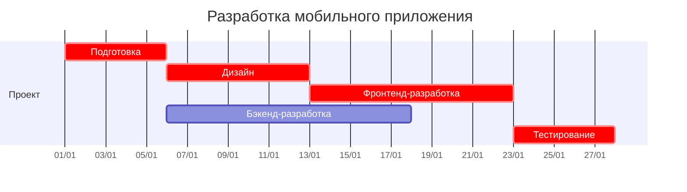
```mermaid
gantt
    title Разработка мобильного приложения
    dateFormat  YYYY-MM-DD
    axisFormat  %d/%m
    
    section Проект
    Подготовка :crit, prep, 2024-01-01, 5d
    Дизайн :crit, design, after prep, 7d
    Фронтенд-разработка :crit, frontend, after design, 10d
    Бэкенд-разработка :backend, after prep, 12d
    Тестирование :crit, test, after frontend, 5d
```
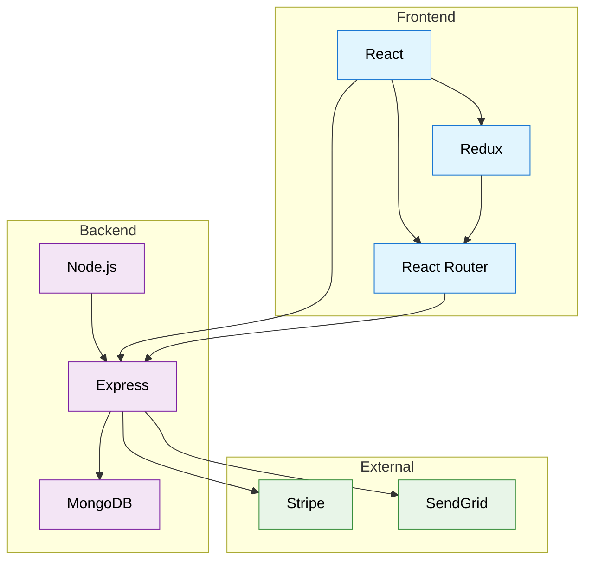
```mermaid 
graph TD
    subgraph Frontend
        A[React]
        B[Redux]
        C[React Router]
    end
    
    subgraph Backend
        D[Node.js]
        E[Express]
        F[MongoDB]
    end
    
    subgraph External
        G[Stripe]
        H[SendGrid]
    end
    
    %% Внутренние связи Frontend
    A --> B
    A --> C
    B --> C
    
    %% Внутренние связи Backend
    D --> E
    E --> F
    
    %% Связи между Frontend и Backend
    A --> E
    C --> E
    
    %% Связи Backend с внешними сервисами
    E --> G
    E --> H
    
    %% Стилизация с черным текстом
    classDef frontend fill:#e1f5fe,stroke:#1976d2,color:#000000
    classDef backend fill:#f3e5f5,stroke:#7b1fa2,color:#000000
    classDef external fill:#e8f5e8,stroke:#388e3c,color:#000000
    
    class A,B,C frontend
    class D,E,F backend
    class G,H external
```
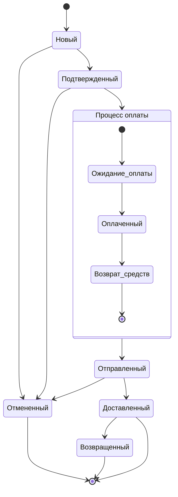
```mermaid 
stateDiagram-v2
    [*] --> Новый
    
    state "Процесс оплаты" as оплата {
        [*] --> Ожидание_оплаты
        Ожидание_оплаты --> Оплаченный
        Оплаченный --> Возврат_средств
        Возврат_средств --> [*]
    }
    
    Новый --> Подтвержденный
    Подтвержденный --> оплата
    Новый --> Отмененный
    Подтвержденный --> Отмененный
    
    оплата --> Отправленный
    Отправленный --> Доставленный
    Отправленный --> Отмененный
    Доставленный --> Возвращенный
    
    Отмененный --> [*]
    Возвращенный --> [*]
    Доставленный --> [*]
```
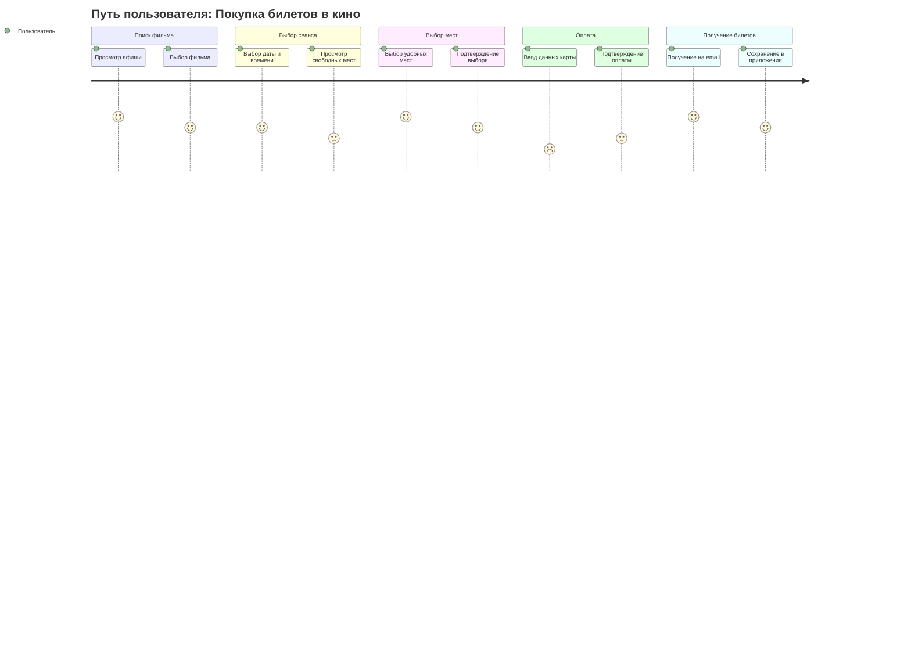
```mermaid
journey
    title Путь пользователя: Покупка билетов в кино
    section Поиск фильма
      Просмотр афиши: 5: Пользователь
      Выбор фильма: 4: Пользователь
    section Выбор сеанса
      Выбор даты и времени: 4: Пользователь
      Просмотр свободных мест: 3: Пользователь
    section Выбор мест
      Выбор удобных мест: 5: Пользователь
      Подтверждение выбора: 4: Пользователь
    section Оплата
      Ввод данных карты: 2: Пользователь
      Подтверждение оплаты: 3: Пользователь
    section Получение билетов
      Получение на email: 5: Пользователь
      Сохранение в приложении: 4: Пользователь
```
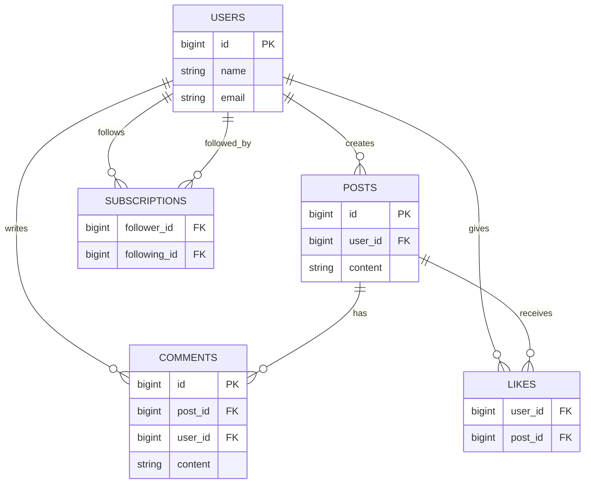
```mermaid
erDiagram
    USERS {
        bigint id PK
        string name
        string email
    }
    
    POSTS {
        bigint id PK
        bigint user_id FK
        string content
    }
    
    COMMENTS {
        bigint id PK
        bigint post_id FK
        bigint user_id FK
        string content
    }
    
    LIKES {
        bigint user_id FK
        bigint post_id FK
    }
    
    SUBSCRIPTIONS {
        bigint follower_id FK
        bigint following_id FK
    }

    USERS ||--o{ POSTS : creates
    USERS ||--o{ COMMENTS : writes
    POSTS ||--o{ COMMENTS : has
    USERS ||--o{ LIKES : gives
    POSTS ||--o{ LIKES : receives
    USERS ||--o{ SUBSCRIPTIONS : follows
    USERS ||--o{ SUBSCRIPTIONS : followed_by
```
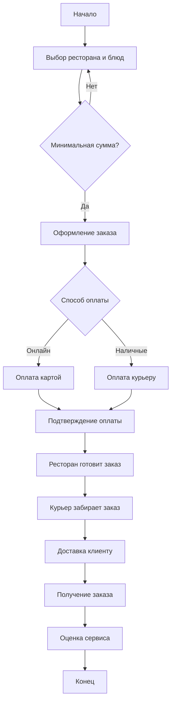
```mermaid
graph TD
    A[Начало] --> B[Выбор ресторана и блюд]
    B --> C{Минимальная сумма?}
    C -->|Нет| B
    C -->|Да| D[Оформление заказа]
    D --> E{Способ оплаты}
    E -->|Онлайн| F[Оплата картой]
    E -->|Наличные| G[Оплата курьеру]
    F --> H[Подтверждение оплаты]
    G --> H
    H --> I[Ресторан готовит заказ]
    I --> J[Курьер забирает заказ]
    J --> K[Доставка клиенту]
    K --> L[Получение заказа]
    L --> M[Оценка сервиса]
    M --> N[Конец]
```
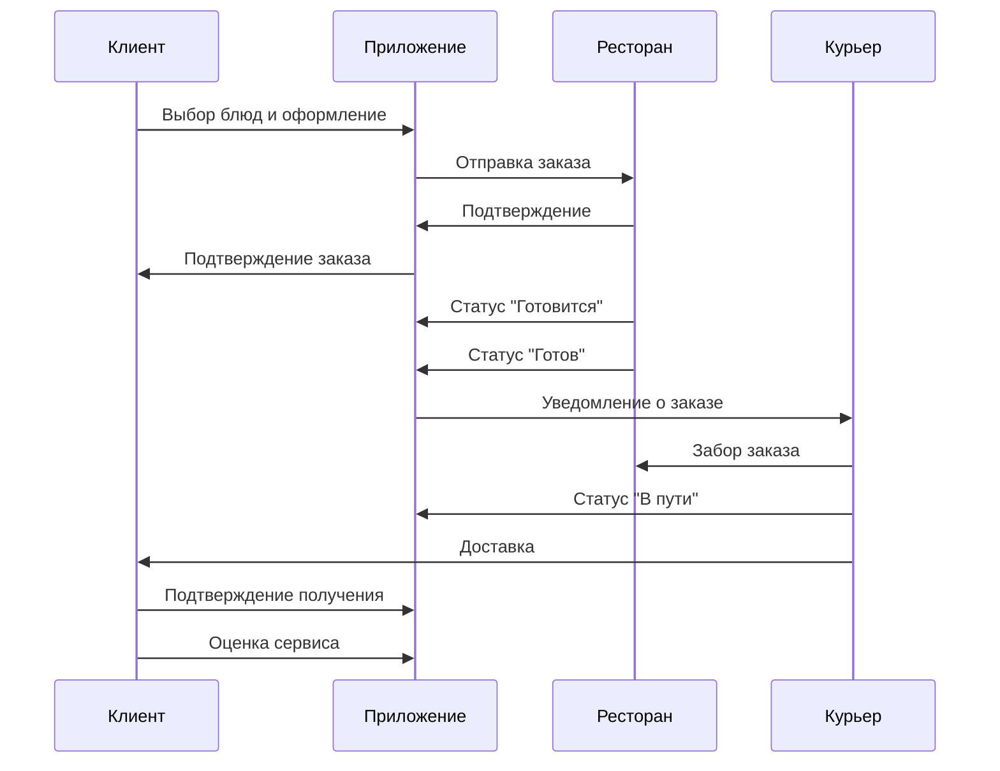
```mermaid
sequenceDiagram
    participant К as Клиент
    participant П as Приложение
    participant Р as Ресторан
    participant Кур as Курьер

    К->>П: Выбор блюд и оформление
    П->>Р: Отправка заказа
    Р->>П: Подтверждение
    П->>К: Подтверждение заказа
    Р->>П: Статус "Готовится"
    Р->>П: Статус "Готов"
    П->>Кур: Уведомление о заказе
    Кур->>Р: Забор заказа
    Кур->>П: Статус "В пути"
    Кур->>К: Доставка
    К->>П: Подтверждение получения
    К->>П: Оценка сервиса
```
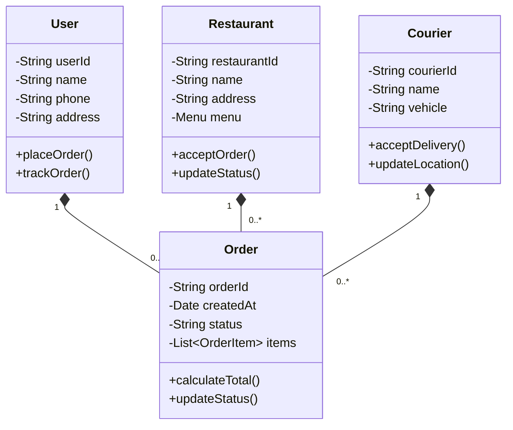
```mermaid
classDiagram
    class User {
        -String userId
        -String name
        -String phone
        -String address
        +placeOrder()
        +trackOrder()
    }
    
    class Restaurant {
        -String restaurantId
        -String name
        -String address
        -Menu menu
        +acceptOrder()
        +updateStatus()
    }
    
    class Courier {
        -String courierId
        -String name
        -String vehicle
        +acceptDelivery()
        +updateLocation()
    }
    
    class Order {
        -String orderId
        -Date createdAt
        -String status
        -List~OrderItem~ items
        +calculateTotal()
        +updateStatus()
    }
    
    User "1" *-- "0..*" Order
    Restaurant "1" *-- "0..*" Order
    Courier "1" *-- "0..*" Order
```
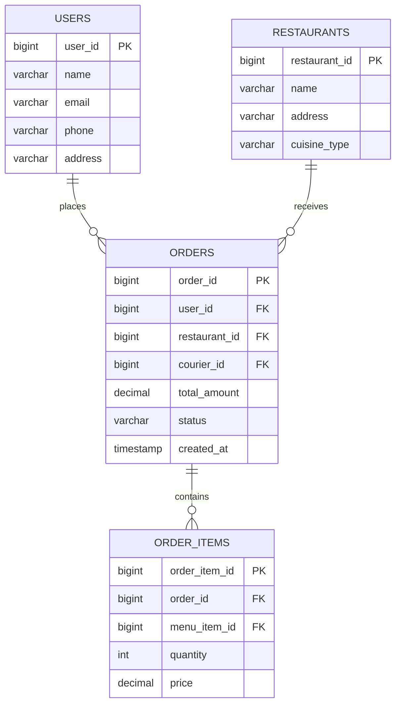
```mermaid
erDiagram
    USERS {
        bigint user_id PK
        varchar name
        varchar email
        varchar phone
        varchar address
    }
    
    RESTAURANTS {
        bigint restaurant_id PK
        varchar name
        varchar address
        varchar cuisine_type
    }
    
    ORDERS {
        bigint order_id PK
        bigint user_id FK
        bigint restaurant_id FK
        bigint courier_id FK
        decimal total_amount
        varchar status
        timestamp created_at
    }
    
    ORDER_ITEMS {
        bigint order_item_id PK
        bigint order_id FK
        bigint menu_item_id FK
        int quantity
        decimal price
    }
    
    USERS ||--o{ ORDERS : places
    RESTAURANTS ||--o{ ORDERS : receives
    ORDERS ||--o{ ORDER_ITEMS : contains
```
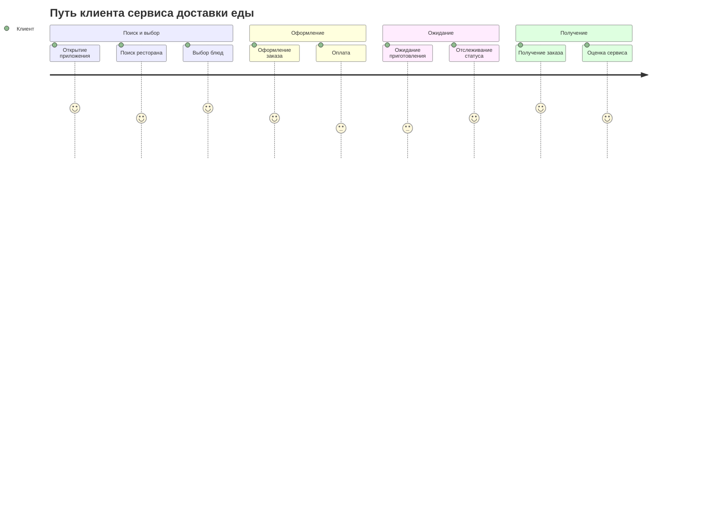
```mermaid
journey
    title Путь клиента сервиса доставки еды
    section Поиск и выбор
      Открытие приложения: 5: Клиент
      Поиск ресторана: 4: Клиент
      Выбор блюд: 5: Клиент
    section Оформление
      Оформление заказа: 4: Клиент
      Оплата: 3: Клиент
    section Ожидание
      Ожидание приготовления: 3: Клиент
      Отслеживание статуса: 4: Клиент
    section Получение
      Получение заказа: 5: Клиент
      Оценка сервиса: 4: Клиент
```
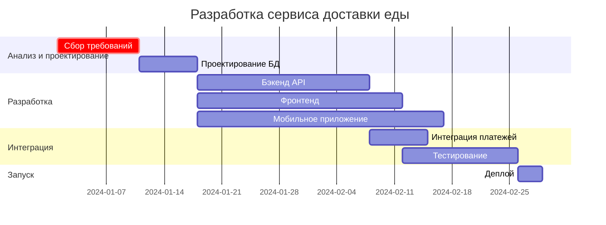
```mermaid
gantt
    title Разработка сервиса доставки еды
    dateFormat YYYY-MM-DD
    
    section Анализ и проектирование
    Сбор требований     :crit, req, 2024-01-01, 10d
    Проектирование БД   :design, after req, 7d
    section Разработка
    Бэкенд API         :backend, after design, 21d
    Фронтенд           :frontend, after design, 25d
    Мобильное приложение :mobile, after design, 30d
    section Интеграция
    Интеграция платежей :payments, after backend, 7d
    Тестирование       :testing, after frontend, 14d
    section Запуск
    Деплой             :deploy, after testing, 3d
```
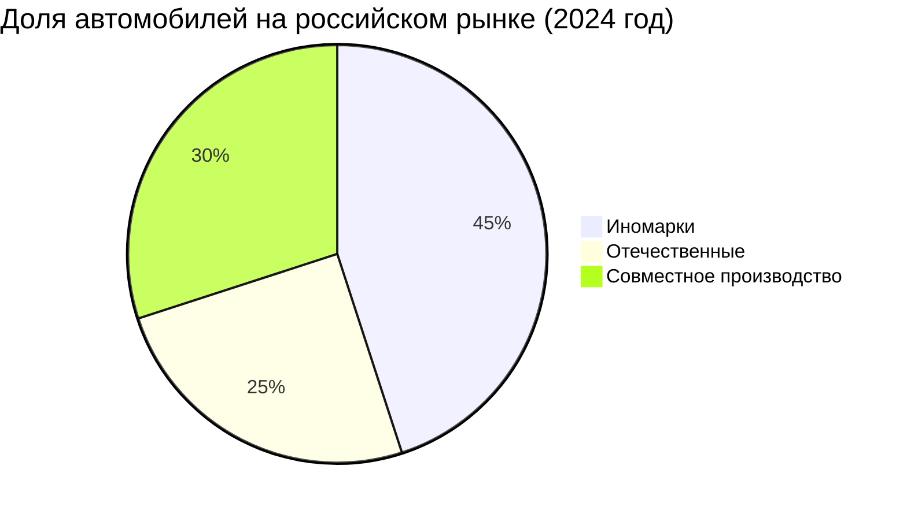
```mermaid
pie
    title Доля автомобилей на российском рынке (2024 год)
    "Иномарки" : 45
    "Отечественные" : 25
    "Совместное производство" : 30
```