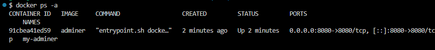
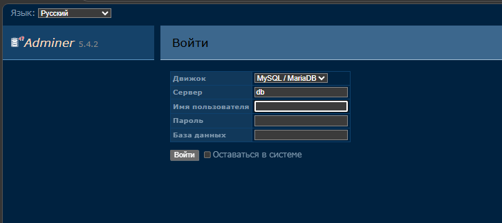

Вот инструкция по установке adminer в Docker, из которой убраны все упоминания о необходимости настройки или запуска отдельной базы данных. Инструкция предполагает, что база данных уже где-то существует и доступна, либо используется образ, включающий БД "из коробки".

### Инструкция по быстрому запуску adminer в Docker (без настройки БД)

#### 1. Подготовка системы
Убедитесь, что на вашем компьютере установлен Docker. Проверить установку можно командой:
```bash
docker --version
```

#### 2. Запуск контейнера adminer
Для быстрого ознакомления можно использовать готовый образ, который включает в себя все необходимые компоненты (само приложение и веб-интерфейс). База данных в таком образе либо уже настроена внутри, либо подключается автоматически.

Выполните следующую команду для запуска контейнера:
```bash
bash docker run -d --name my-adminer -p 8080:8080 adminer
```

*Примечание: Этот образ содержит предварительно настроенную демонстрационную базу данных, поэтому никаких дополнительных действий не требуется.*

#### 3. Проверка запуска
Убедитесь, что контейнер успешно запущен и готов к работе:
```bash
docker ps -a
```

Вы должны увидеть контейнер `adminer` со статусом `Up`. Подождите 1-2 минуты, пока приложение полностью инициализируется.

Проверьте логи, чтобы убедиться, что процесс загрузки завершен:
```bash
docker logs adminer
```

#### 4. Доступ к системе
Откройте браузер и перейдите по адресу:
```
http://localhost:8080
```


**Данные для входа по умолчанию:**
- **Пользователь:** `GardenAdmin`
- **Пароль:** `GardenAdmin`

#### 5. Управление контейнером
- Остановка контейнера:
  ```bash
  docker stop adminer
  ```
- Запуск остановленного контейнера:
  ```bash
  docker start adminer
  ```
- Удаление контейнера (все данные внутри контейнера будут потеряны):
  ```bash
  docker rm adminer
  ```
- Просмотр логов в реальном времени:
  ```bash
  docker logs -f adminer
  ```

#### Важные замечания
1. Данный способ установки предназначен для **ознакомительных и тестовых целей**. Образ содержит встроенную базу данных, что удобно для быстрого старта, но не подходит для production-среды.
2. При удалении контейнера командой `docker rm` все данные, включая демонстрационную БД, будут утеряны. Для сохранения данных необходимо использовать Docker Volumes.
3. Если вам нужно подключиться к внешней базе данных, потребуются дополнительные параметры запуска с указанием переменных окружения для подключения к вашему серверу БД.