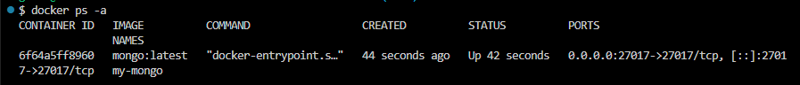
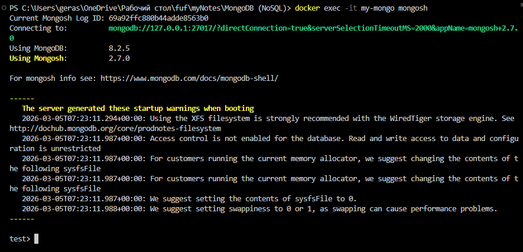

### MongoDB (NoSQL)

### Проверить Docker

Получить версию установленного у вас Docker
```shell
docker version
```
### 2. Запуск MongoDB
```bash
docker run -d \
  --name my-mongo \
  -p 27017:27017 \
  mongo:latest
```
#### 3. Проверка установки
Убедитесь, что контейнер успешно запущен:
```bash
docker ps -a
```


### 4. Подключиться через shell
```shell
docker exec -it my-mongo mongosh
```
