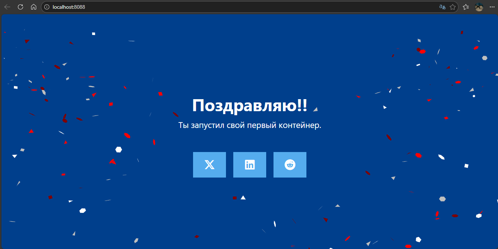
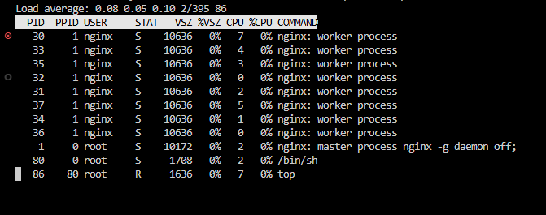
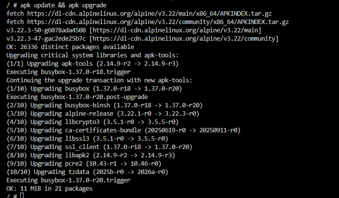
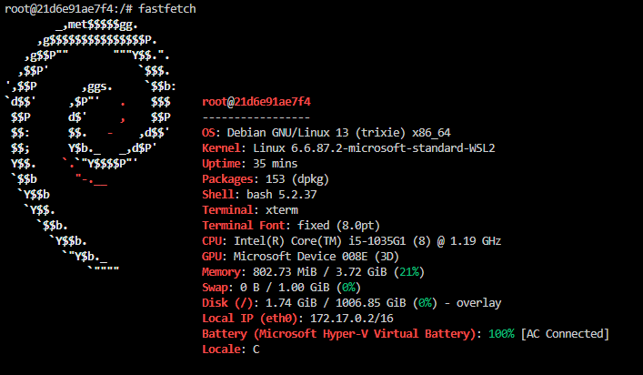

## Welcome to Docker

> Никогда в разработке не используйте русские имена файлов и каталогов!
> Никогда в разработке не используйте пробелы и спецюсимволы в именах файлов и каталогов!

Это репозиторий для новых пользователей, начинающих работу с Docker

Для выполнения задания создайте в репозитории отдельную папку `Docker`, в ней папку `img` и папку `WelcomeToDocker` и в ней файл `README.md`.

> Перед созданием проекта убедитесь, что порт `8080` не занят другим приложением!

Проверить порт `8080` для **Linux/Mac/WSL**:
```shell
# Проверьте, занят ли порт
netstat -tuln | grep :8080
```
> Если эта команда ничего не возвращает, то порт свободен

Проверить порт `8080` для **Windows**:
```shell
netstat -aon | findstr :8080
```

Загрузить образ и запустить контейнера
```shell
docker run -d -p 8080:80 --name welcome-to-docker docker/welcome-to-docker
```

[Открыть http://localhost:8080 в браузере](http://localhost:8080)



Зайти в контейнер
```shell
docker exec -it welcome-to-docker /bin/sh
```

Повыполнять разные команды:

Показать ин-фу по ОС
```shell
uname -a
```
Диспетчер ресурсов
```shell
top
```


Обновить источники приложений
```shell
apk update && apk upgrade
```


Установить приложение
```shell
apk add fastfetch
```
Запустить приложение
```shell
fastfetch
```



